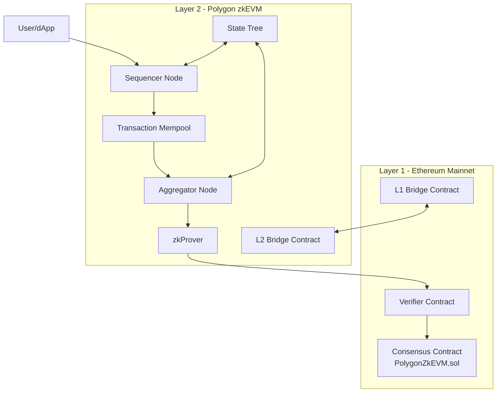

# Polygon-zkVM-Architecture

```mermaid
graph TB
    subgraph "Layer 1 - Ethereum Mainnet"
        CC[Consensus Contract<br>PolygonZkEVM.sol]
        VC[Verifier Contract]
        B1[L1 Bridge Contract]
    end

    subgraph "Layer 2 - Polygon zkEVM"
        SN[Sequencer Node]
        AN[Aggregator Node]
        ZP[zkProver]
        B2[L2 Bridge Contract]
        MP[Transaction Mempool]
        ST[State Tree]
    end

    User[User/dApp] --> SN
    SN --> MP
    MP --> AN
    AN --> ZP
    ZP --> VC
    VC --> CC
    ST <--> SN
    ST <--> AN
    
    B1 <--> B2

    
    class CC,VC,B1 L1;
    class SN,AN,ZP,B2,MP,ST L2;
```
