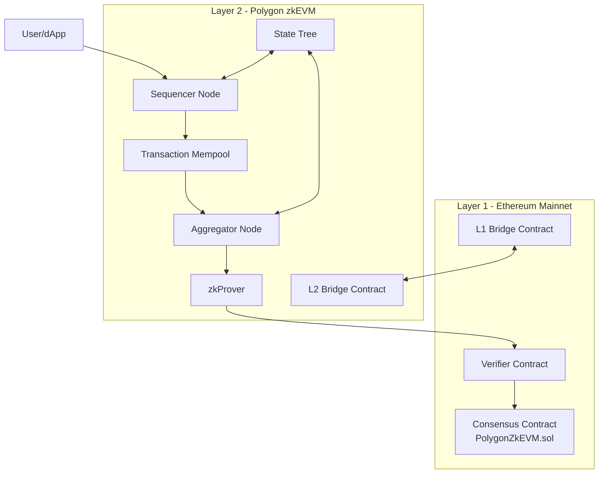

# Polygon-zkVM-Architecture

## Architecture Diagram

## Layer 1 Components
- Consensus Contract (PolygonZkEVM.sol): Manages L2 state updates and coordinates consensus
- Verifier Contract: Verifies ZK-SNARK proofs efficiently
- L1 Bridge Contract: Handles cross-chain asset transfers using Lock & Mint mechanism

## Layer 2 Components
- Sequencer Node:
  - Collects and executes transactions
  - Updates local state
  - Broadcasts to other L2 nodes
  - Submits batches to L1 every 1-3 minutes
- Aggregator Node:
  - Collects transaction batches
  - Coordinates with zkProver
  - Submits proofs to L1
- zkProver: Generates zero-knowledge proofs for transaction batches
- State Tree: Maintains L2 state
- Transaction Mempool: Temporary storage for pending transactions
- L2 Bridge Contract: Handles cross-chain assets using Burn & Release mechanism

## Transaction Finality
- Immediate: Transaction appears in L2 mempool
- 1-3 minutes: Batch posted to L1 Consensus Contract
- ~30 minutes: Final settlement with ZK proof on Ethereum

